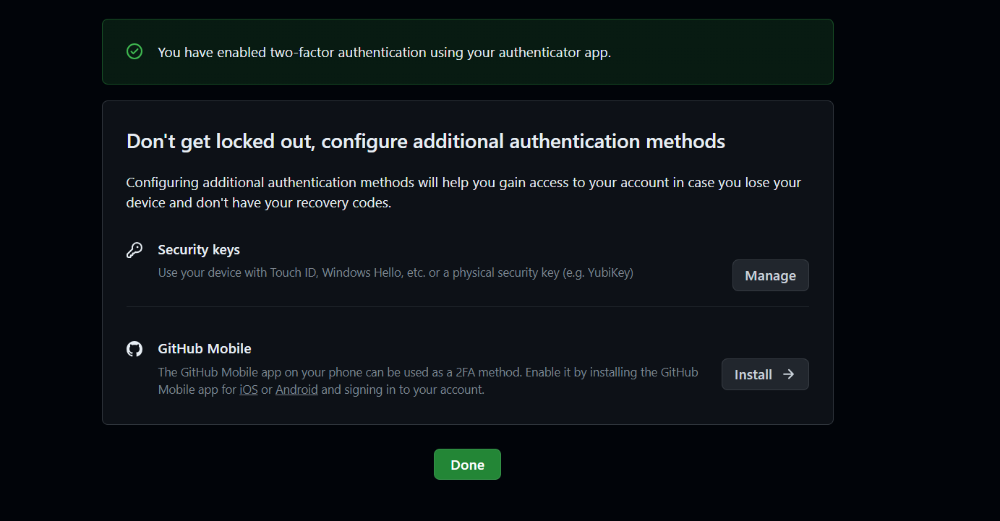

# iw2023ittepic
InterfacesWeb
--clonar el repo
git clone https://github.com/PaulOchoa952/iw2023ittepic.git
--commit
git commit -m "Initial commit"

--push inicial
git push origin main 
--ignorar archivos

--añadir archivos 1.txt al repo local

---creacion de tag
git tag v0.1

--subir cambios al repo remoto  

git push origin main  

--cuenta de github  

--uso social

---tabla de compañeros
|Nombre | Enlace|
|--------------|------------------------------|
|IvanRobles19  |https://github.com/IvanRobles19|
|Andres        |https://github.com/andrestian01|
|Paul Razon    |https://github.com/PaulRazon|
|Victor Pacheco|https://github.com/XxXelbichoXxX|
|Erick Ramirez|https://github.com/Elery2711|
            
--añadir colaborador

--